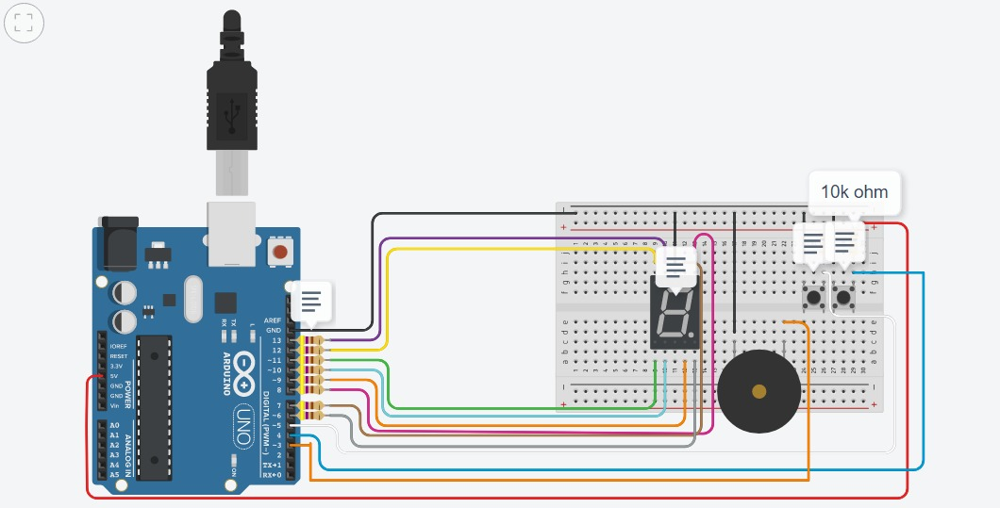
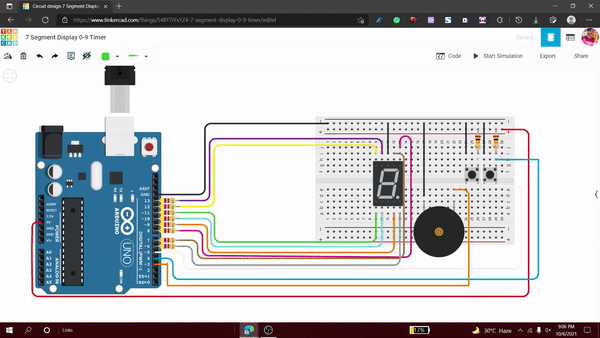

# 7Segment_Display_Timer
This device can set a timer (reverse-count) from 0-9. And on (pressing) timer-button, the timer on display will decrement along with a buzzer indicating the end of duration (for which timer was set). The decremented time period is 1 second for each.

**CIRCUIT DIAGRAM:**  

| Name                                	| Quantity 	| Component                 	|
|-------------------------------------	|----------	|---------------------------	|
| U1                                  	|     1    	| Arduino Uno R3            	|
| R1 R2 R3 R4 R5 R6    	|     6    	| 0.47 kΩ Resistor          	|
| R7 R8                            	|     2    	| 470 Ω Resistor            	|
| Digit2                              	|     1    	| Cathode 7 Segment Display 	|
| R10 R11                          	|     2    	| 10 kΩ Resistor            	|
| StimerBbutton SstartTimerBbutton 	|     2    	| Pushbutton                	|
| PIEZO1                              	|     1    	| Piezo                     	|

 - 7 Segment Display Simulation  

## Visualize [here](https://www.tinkercad.com/things/54BY7iYxYZ4-7-segment-display-0-9-timer).

## Steps to run
* Press timer-button (less than or equal to 9 times)
* The respective digit will be displayed on the Display
* The click on start-timer button
* the display will start reverse-counting till zero, imitating a timer.
* the buzzer will make sound when it reaches to initial (0) value.

It was a challenge for me to use a display and make it count in reverse. I encountered many bugs. All of them were resolved after reading a lot of documentation. PS: Reading Docs are better than any YT video.
 
The next challenge was to setup the buttons, where one of them will stat the timer and other will re-set the value and make display count reverse. Then, I added a buzzer so that this project can actually be used as a useful device.

### Future Aspect
I will be making it more robut and scalable. I will add better music replacing buzzer. I will also add a bigger display that will enable user to set more time.

By [Ish Kapoor](https://github.com/ishkapoor2000/)